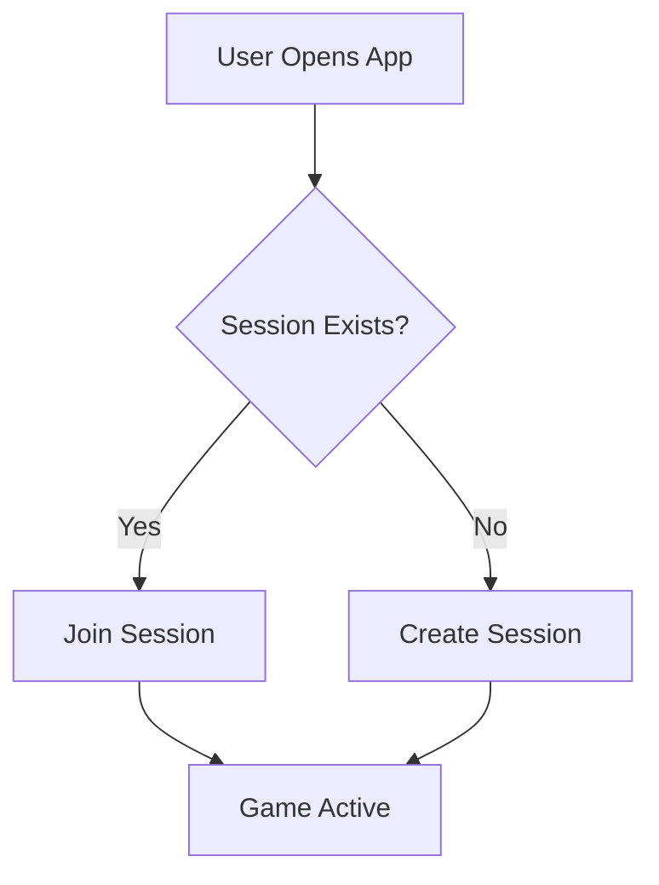

# Documentation Guidelines for YourTurn

## Documentation Locations

### Project Documentation

- **README.md**: Project overview, setup instructions, basic usage
- **CHANGELOG.md**: Version history and release notes
- **docs/**: Detailed documentation
  - `requirements.md`: Original project requirements
  - `initial-conversation.txt`: Project genesis notes
  - `firebase-setup.md`: Firebase App Distribution setup guide
  - `ios-signing-setup-guide.md`: iOS code signing instructions

### Code Documentation

- Inline comments for complex logic
- Doc comments for public APIs
- README files in subdirectories for module-specific documentation

## Documentation Standards

### README.md Structure

```markdown
# YourTurn

Brief description (1-2 sentences)

## Features
- Bullet list of main features

## Getting Started
### Prerequisites
### Installation
### Running the App

## Architecture
Link to architecture documentation

## Development
### Building
### Testing
### Deployment

## Contributing
Guidelines for contributors

## License
```

### CHANGELOG.md Format

Follow [Keep a Changelog](https://keepachangelog.com/) format:

```markdown
## [VERSION] - YYYY-MM-DD

### Added
- New features

### Changed
- Changes to existing functionality

### Deprecated
- Soon-to-be removed features

### Removed
- Removed features

### Fixed
- Bug fixes

### Security
- Security fixes

---
```

**Important**: Use `---` delimiter between versions for CI/CD parsing.

### Code Comments

#### When to Comment

✅ **Do comment**:

- Complex algorithms or business logic
- Non-obvious workarounds or hacks
- Platform-specific considerations
- TODOs with context

❌ **Don't comment**:

- Obvious code (the code itself is the documentation)
- Redundant information already in the code
- Outdated information (delete instead)

#### Comment Style

```dart
/// Public API documentation using triple-slash
/// 
/// Longer description if needed.
/// 
/// Example:
/// ```dart
/// final controller = SessionController();
/// controller.startSession();
/// ```
class SessionController extends ChangeNotifier {
  // Private implementation details using double-slash
  String _sessionId;
  
  /// Creates a new game session with the given [playerName].
  /// 
  /// Returns the session ID if successful.
  /// Throws [SessionException] if session creation fails.
  Future<String> createSession(String playerName) async {
    // Implementation details...
  }
}
```

### Platform-Specific Documentation

#### Android Notes

Document in `android/NOTES.txt`:

- Permissions required and why
- Gradle configuration notes
- Platform-specific implementation details
- Testing considerations

#### iOS Notes

Document in `ios/NOTES.txt`:

- iOS capabilities required
- Info.plist configuration
- Platform-specific implementation details
- Testing considerations

### API Documentation

For P2P service and public APIs:

```dart
/// Service for peer-to-peer communication between devices.
/// 
/// This abstract class defines the contract for P2P implementations.
/// Platform-specific implementations should handle:
/// - Device discovery
/// - Connection management
/// - Message routing
/// 
/// Example usage:
/// ```dart
/// final service = P2PService.create();
/// await service.initialize();
/// await service.startDiscovery();
/// ```
abstract class P2PService {
  /// Initializes the P2P service.
  /// 
  /// Must be called before any other operations.
  /// Returns `true` if initialization was successful.
  Future<bool> initialize();
  
  /// Starts discovering nearby devices.
  /// 
  /// Throws [P2PException] if the service is not initialized.
  Future<void> startDiscovery();
}
```

## Maintenance Guidelines

### Keeping Documentation Up-to-Date

#### When Code Changes

1. Update inline documentation if behavior changes
2. Update README.md if user-facing features change
3. Add entry to CHANGELOG.md for next release
4. Update architecture docs if structure changes

#### Before Each Release

1. Review and update CHANGELOG.md
2. Verify README.md accuracy
3. Update version in pubspec.yaml
4. Commit documentation changes with code changes

#### Regular Reviews

- Quarterly: Review all documentation for accuracy
- After major features: Update architecture documentation
- When onboarding new developers: Review setup documentation

## Documentation Formats

### Markdown (.md)

- All project documentation
- Use GitHub-flavored markdown
- Preview before committing

### Code Comments

- Dart doc comments (///)
- Standard comments (//)
- TODOs in format: `// TODO(username): Description`

### External Documentation

- Link to Flutter docs for standard widgets
- Link to package documentation for dependencies
- Don't duplicate external documentation

## Diagrams and Visual Documentation

### When to Use Diagrams

- Architecture overviews
- Data flow diagrams
- State machines
- Network topology

### Diagram Tools

- Mermaid (for markdown-embeddable diagrams)
- Draw.io (for complex diagrams)
- ASCII art for simple representations

### Example Mermaid Diagram

```markdown


```

## TODO Management

### TODO Format
```dart
// TODO(username): Brief description of what needs to be done
// Context: Why it needs to be done
// Priority: High/Medium/Low
```

### TODO Tracking

- Use GitHub Issues for major TODOs
- Link code TODOs to issues: `// TODO(#123): Description`
- Review TODOs regularly
- Remove completed TODOs immediately

## Error Messages and User-Facing Text

### Error Messages

- Be specific about what went wrong
- Suggest how to fix it
- Include error codes for debugging
- Example: "Failed to connect to device 'Player1'. Check Bluetooth is enabled and devices are in range. (Error: BLE_TIMEOUT)"

### User Instructions

- Write in second person ("You can...")
- Be concise
- Include examples
- Test with non-technical users

## Documentation Review Process

### Before Merging PRs

- [ ] Code comments are accurate
- [ ] Public APIs are documented
- [ ] README updated if needed
- [ ] CHANGELOG entry added
- [ ] Platform-specific notes updated

### Documentation Checklist

- [ ] No broken links
- [ ] Code examples compile and run
- [ ] Markdown renders correctly
- [ ] Formatting is consistent
- [ ] Spelling and grammar checked
- [ ] No contradictions in documentation

## Resources

- [Dart Documentation Guidelines](https://dart.dev/guides/language/effective-dart/documentation)
- [Keep a Changelog](https://keepachangelog.com/)
- [Semantic Versioning](https://semver.org/)
- [GitHub Markdown Guide](https://guides.github.com/features/mastering-markdown/)
